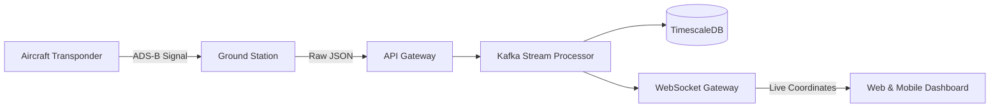

# The Altus Telemetry Stream

## Overview

The Altus Telemetry Stream is a system that ingests real-time position data from aircraft and displays live updates on an operational dashboard. Ground stations capture raw ADS-B signals from aircraft transponders and forward telemetry packets to a dedicated streaming pipeline for parsing, validation, normalisation, and long-term storage. Through a low-latency WebSocket gateway, the location data is broadcast directly to the web and mobile client.

## High-level System Diagram

## System Components

### Ingestion and API Gateway

Ground stations capture raw ADS-B signals from aircraft transponders, format the telemetry into JSON and forward the payload to the API Gateway. The API Gateway handles authenticating requests and the initial payload validation before passing data downstream.

### Event Stream and Processing

Apache Kafka buffers incoming raw telemetry. Stream processing workers consume these events to validate, filter, and normalise spatial data fields (latitude, longitude, altitude, and airspeed) into a standardised format.

### Storage Layer (TimescaleDB)

Normalised telemetry events are persisted to a time-series database optimised for high-write throughput. This layer provides historical route logging, audit compliance, and retrospective flight path analysis.

### WebSocket Gateway

Normalised telemetry events are routed to a WebSocket Gateway that manages persistent, low-latency client connections. The gateway pushes live position updates directly to active web and mobile interfaces.

## Data Flow Sequence

1. **Emission:** Aircraft transmits an ADS-B positional signal over 1090 MHz.
2. **Capture and Ingestion:** A ground receiver station captures the signal, formats it as a JSON payload, and posts it to the Atus API Gateway via HTTPS.
3. **Validation and Processing:** The API Gateway validates authentication headers, then routes the raw payload to Apache Kafka. Stream workers parse and normalise spatial coordinates and telemetry attributes.
4. **Persistence:** The processed telemetry event is stored in TimescaleDB for auditing compliance and analytical queries.
5. **Real-Time Broadcast:** Simultaneously, the event is routed to the WebSocket Gateway, which broadcasts the updated coordinates to all client map dashboards.